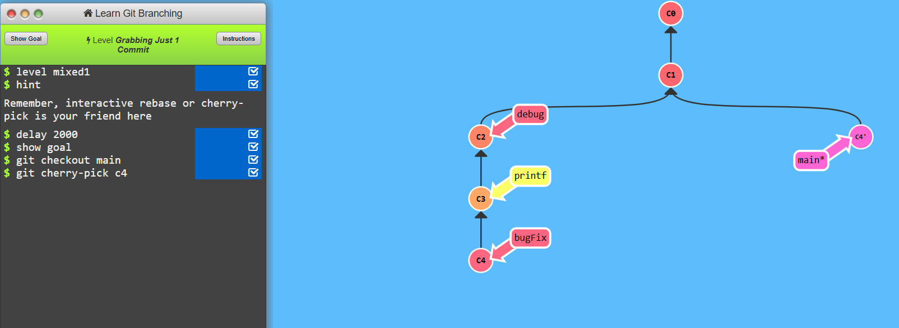
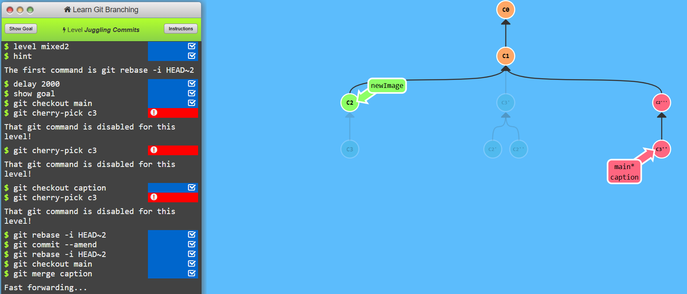
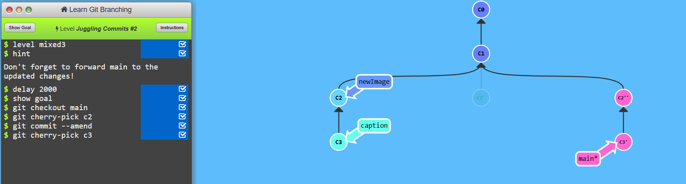
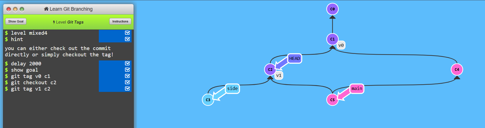
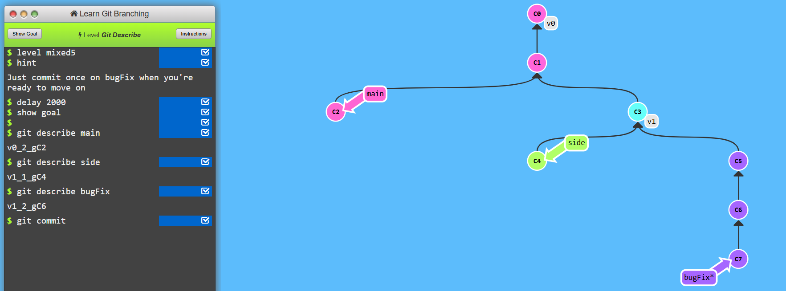

# Level-4 A Mixed Bag

## Task1 Grabbing Just 1 commit
```
    git checkout main
    git cherry-pick c4
```



## Task2 Juggling Commits
```
    git rebase -i HEAD~2
    git commit --amend
    git rebase -i HEAD~2
    git checkout main
    git merge caption 
```


## Task3 Juggling Commits #2
```
    git checkout main
    git cherry-pick c2
    git commit --amend
    git cherry-pick c3
```



## Task4 Git tags
```
   git tag v0 c1
   git checkout c2
   git tag v1 c2 
```



## Task5 Git describe
```
    git describe main (for practice describe command and to see nearest ancestor commit and I did same for branch side and bugFix)
    git describe side
    git describe bugFix
    git commit
```

