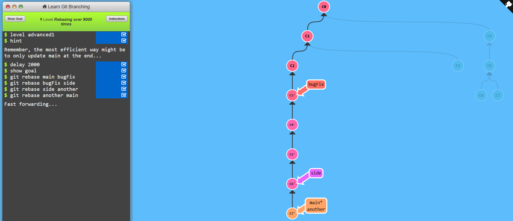
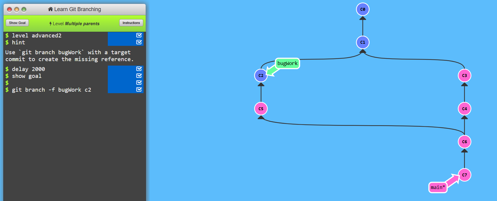
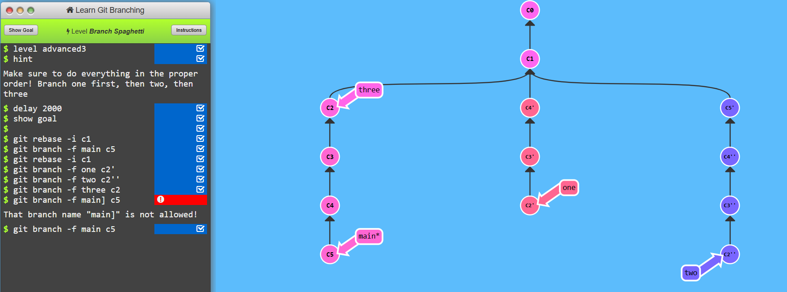
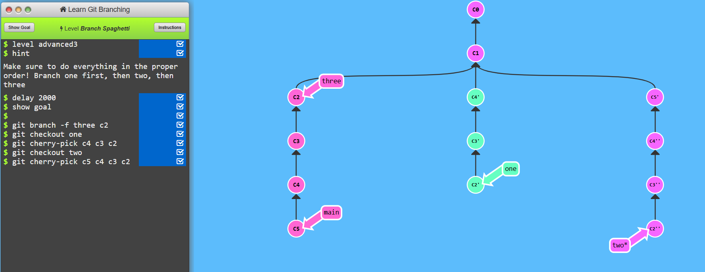

# Level-5 Advanced Topics

## Task1 Rebasing over 9000 times
```
    git rebase main bugFix
    git rebase bugFix side
    git rebase side another
    git rebase another main
```


## Task2 Multiple Parents
```
    git branch -f bugWork c2
```


## Task3 Branch Spaghetti
```
    git rebase -i c1
    git branch -f main c5
    git rebase -i c1
    git branch -f one c2'
    git branch -f two c2''
    git branch -f three c2
    git branch -f main c5
```
## (one way)


```
    git branch -f three c2
    git checkout one
    git cherry-pick c4 c3 c2
    git checkout two
    git cherry-pick c5 c4 c3 c2
```
## (second way)
