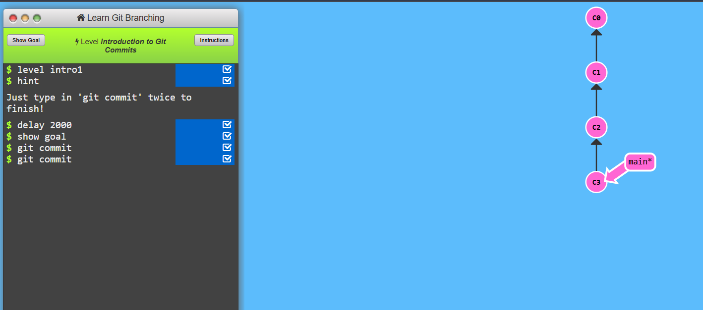
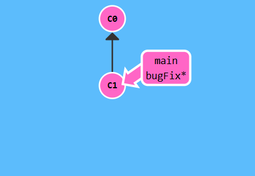
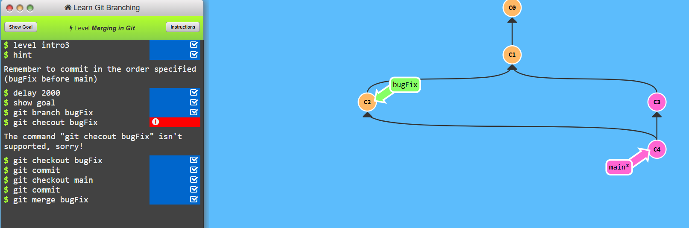
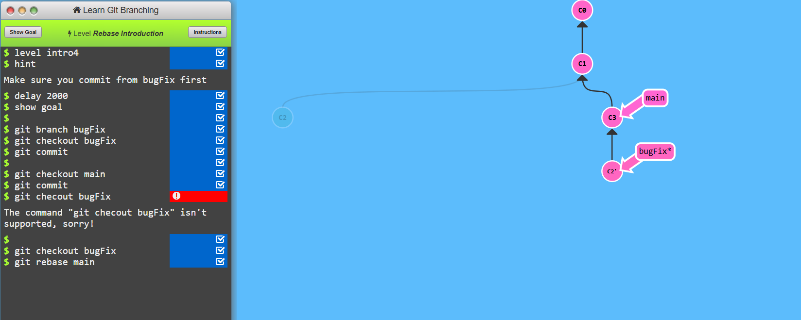

# Level-1 Introduction Sequence 

```
    git commit
    git commit
```



```

```



```
    git branch bugFix
    git checkout bugFix
    git commit 
    git checkout main
    git commit 
    git merge bugFix
```



```
    git branch bugFix
    git checkout bugFix
    git commit
    git checkout main
    git commit
    git checkout bugFix
    git rebase main
   
```
