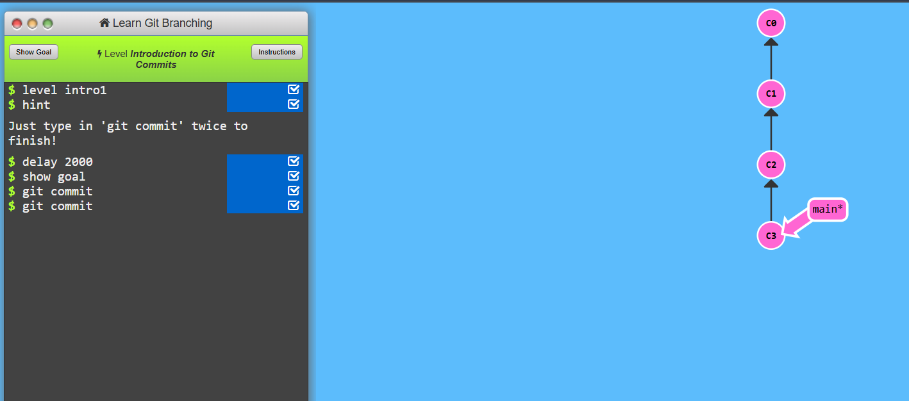
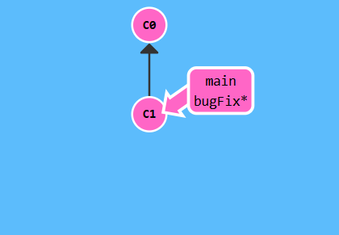
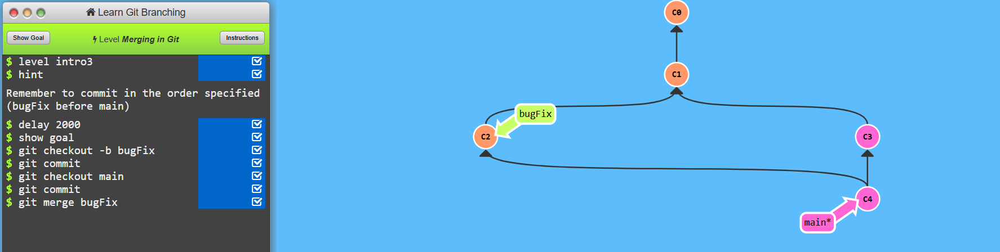
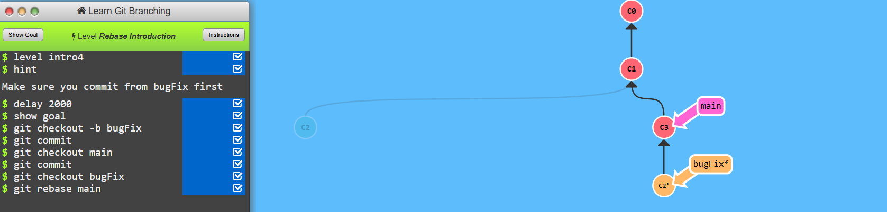

# Level-1 Introduction Sequence 

## Task1 Intorduction to git commits
```
    git commit
    git commit
```


## Task2 Branching a Git
```
    git branch bugFix
    git checkout bugFix
```


## Task3 Merging in git
```
    git checkout -b bugFix
    git commit 
    git checkout main
    git commit 
    git merge bugFix
```


## Task4 Rebase Introduction
```
    git checkout -b bugFix
    git commit
    git checkout main
    git commit
    git checkout bugFix
    git rebase main
   
```
