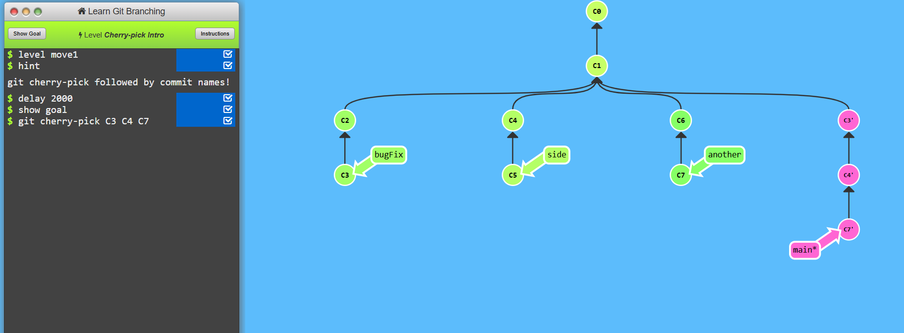
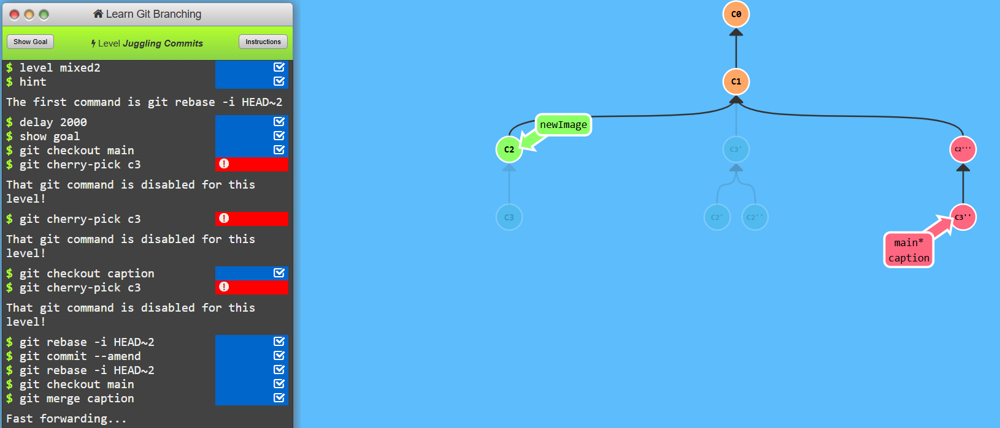

# Level-4 Moving Work Around


```
    git checkout main
    git cherry-pick c4
```


```
    git rebase -i HEAD~2
    git commit --amend
    git rebase -i HEAD~2
    git checkout main
    git merge caption 
```
