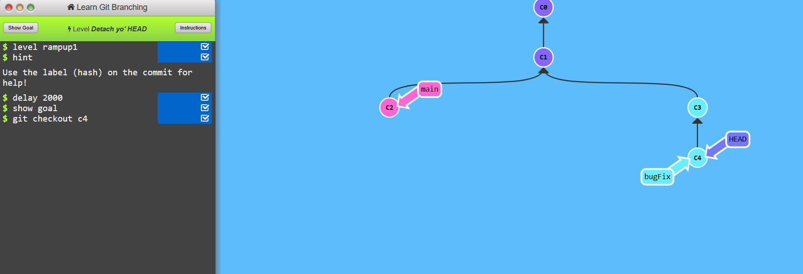
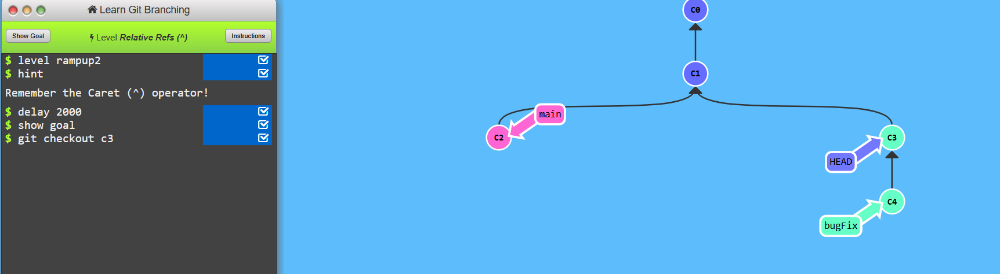
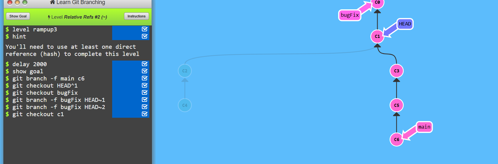
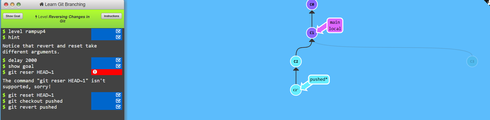

# Level-2 Ramping UP 

## Task1 Detach Head
```
    git checkout c4
```


## Task2 Relative Refs
```
    git checkout c3
```


## Task3 Relative Refs #2
```
   git branch -f main c6
   git checkout HEAD~1
   git branch -f bugFix HEAD~1 
```


## Task4 Reversing Changes in a Git
```
    git reset HEAD~1
    git checkout pushed
    git revert pushed
```
