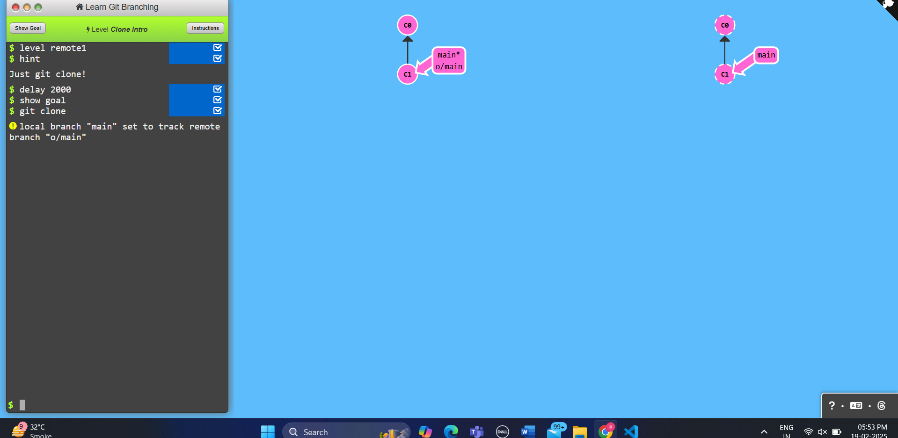
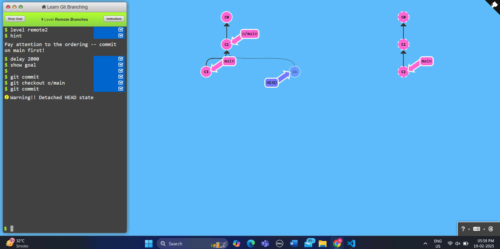
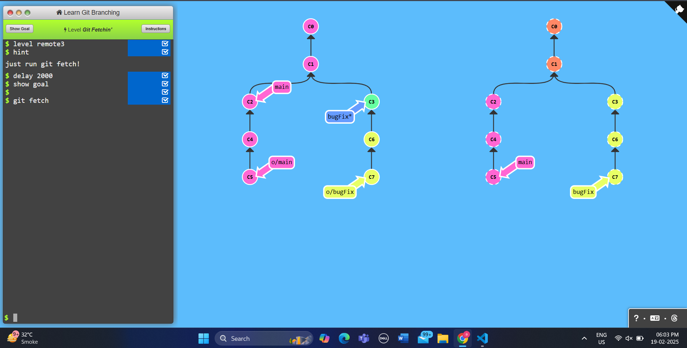
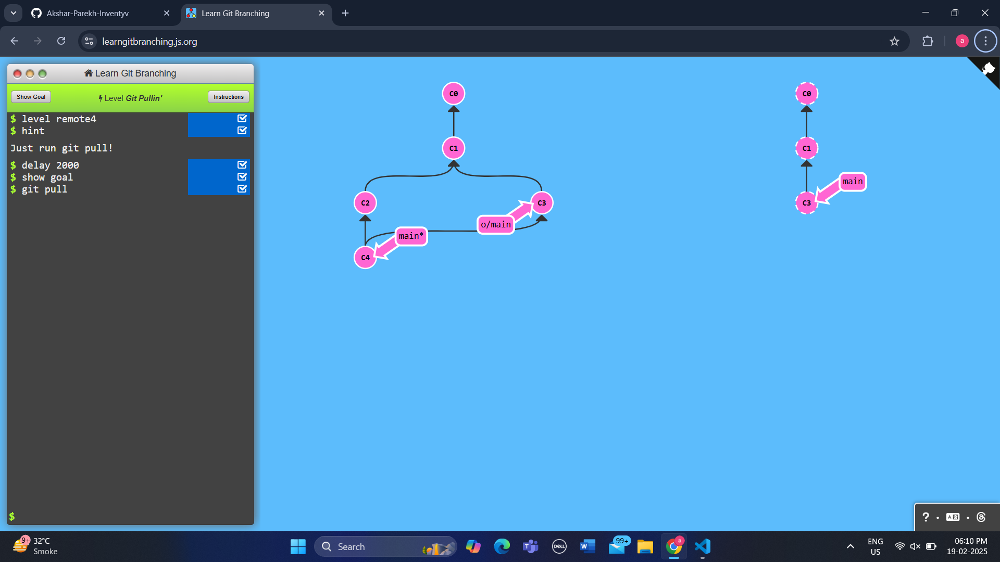
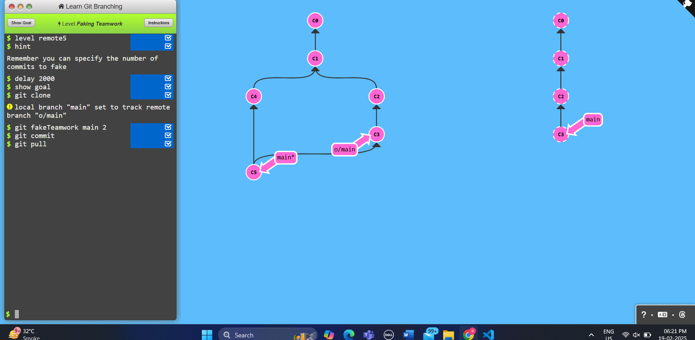
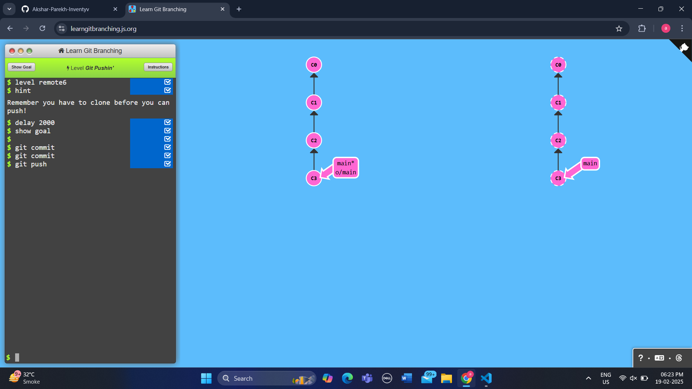
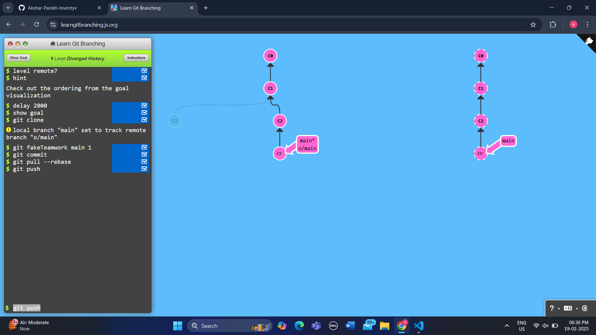
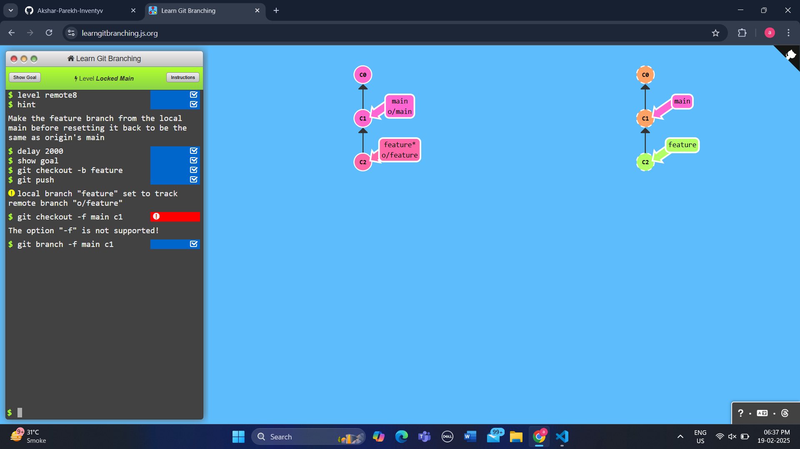

# Level 1 Push & Pull -- Git Remotes!

## Task1 Clone intro

```
    git clone
```


## Task2 Remote Branches
```
    git commit
    git checkout o/main
    git commit
```


## Task3 Git Fetchin'
```
    git fetch
```



## Task4 Git Pullin'
```
    git pull
```



## Task5 Faking Teamwork
```
    git clone
    git fakeTeamwork main 2
    git commit
    git pull
```


## Task6 Git Pushin'
```
   git commit
   git commit
   git push 
```


## Task7 Diverged History
```
   git clone
   git fakeTeamwork main 1
   git commit
   git pull --rebase
   git push 
```


## Task8 Locked Main
```
   git checkout -b feature
   git push
   git branch -f main c1
```

