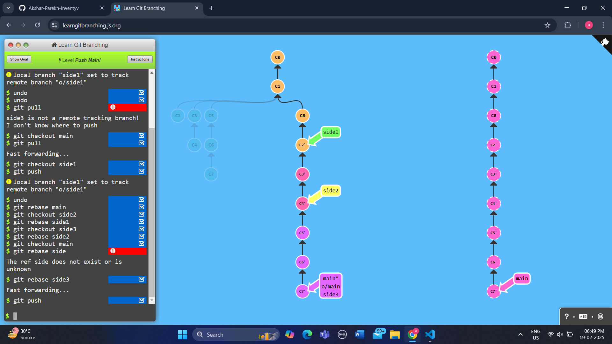
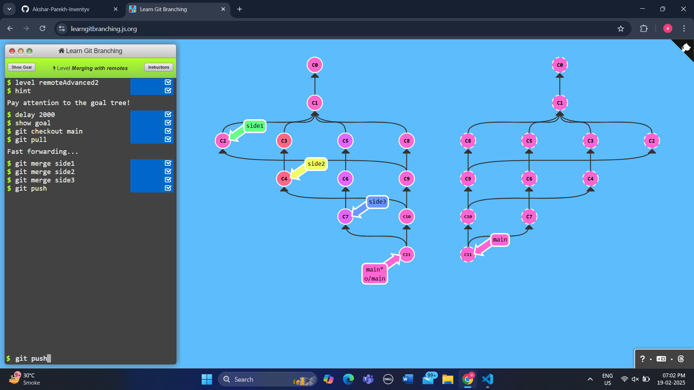
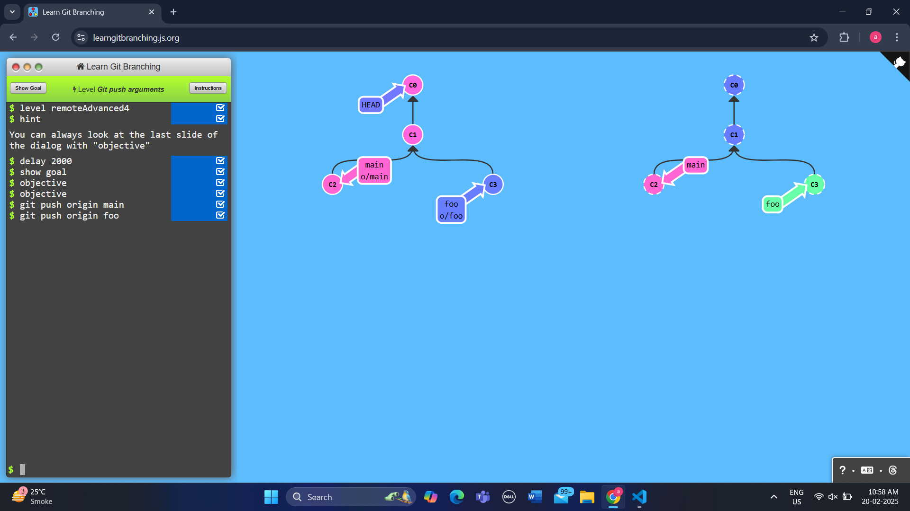
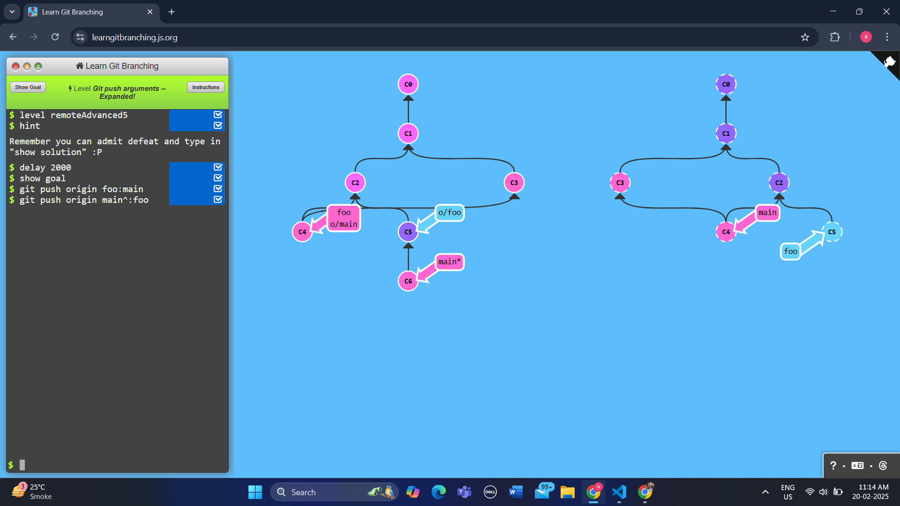
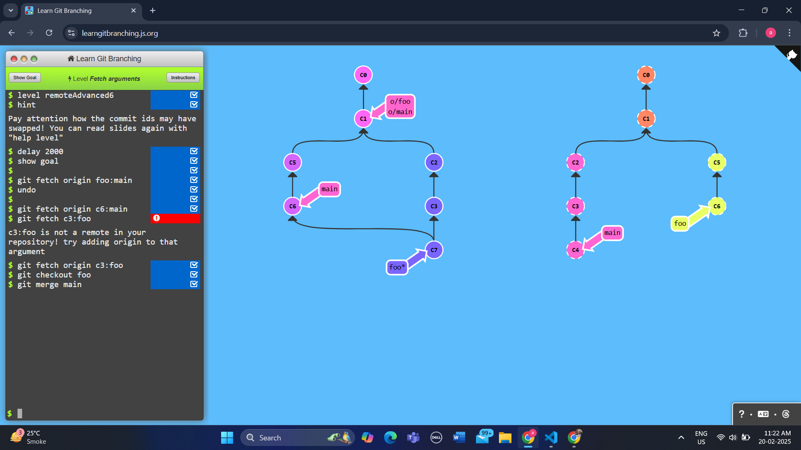
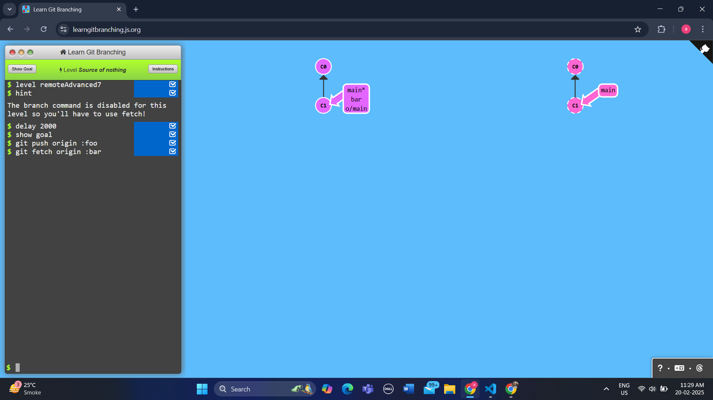
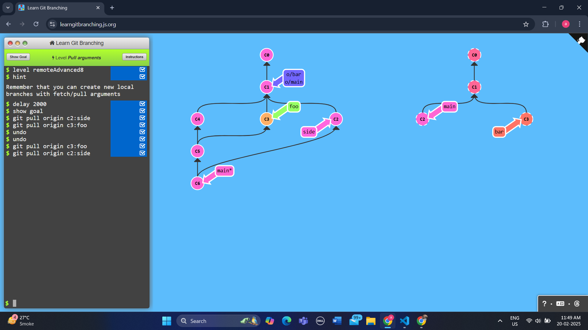

# Level 2 To Origin And Beyond -- Advanced Git Remotes!

## Task1 Push main
```
    git checkout main
    git pull
    git checkout side1
    git rebase main
    git checkout side2
    git rebase side1
    git checkout side3
    git rebase side2
    git checkout main 
    git rebase side3
    git push
```


## Task2 Merging with remotes
```
    git checkout main
    git pull
    git merge side1
    git merge side2
    git merge side3
    git push
```



## Task3 Remote tracking
```
    git checkout -b side
    git commit
    git branch -u o/main
    git pull --rebase
    git push
```


## Task4 Git push arguments
```
    git push origin main
    git push origin foo
```



## Task5 Git push arguments -- Expanded!
```
    git push origin foo:main
    git push origin main^:foo
```



## Task6 Fetch arguments
```
    git fetch origin c6:main
    git fetch c3:foo
    git fetch origin c3:foo
    git checkout foo
    git merge main
```



## Task7 Source of nothing
```
    git push origin :foo
    git fetch origin :bar
```



## Task8 Pull arguments
```
   git pull origin c3:foo
   git pull origin c2:side 
```


